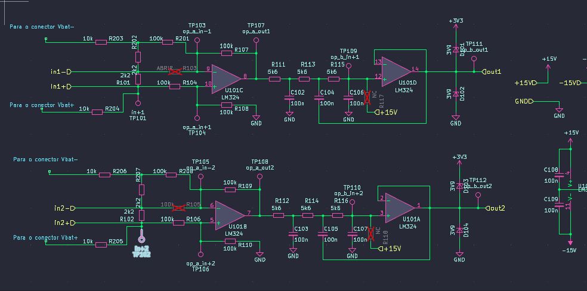
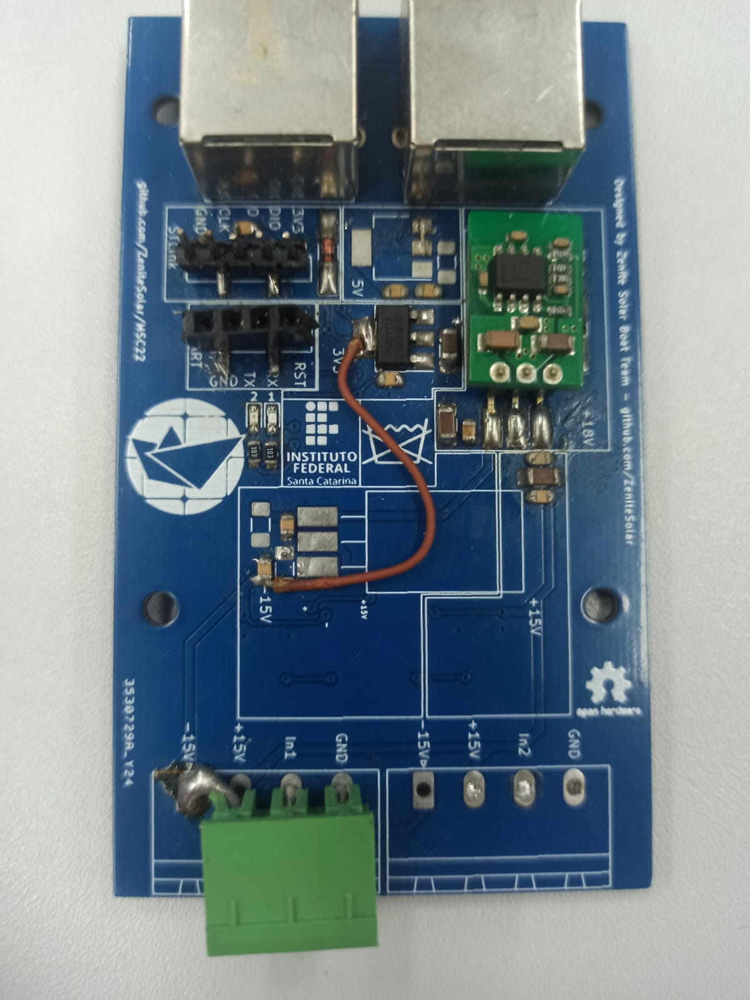
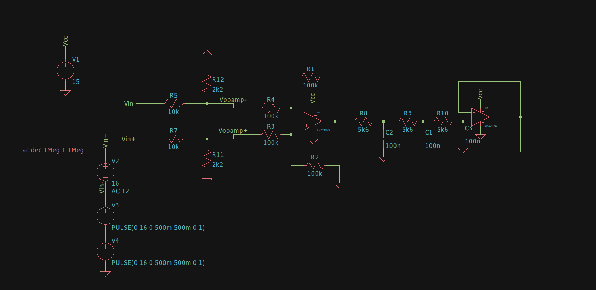

# Transformar MSC23 em sensor de tensão para a bateria

1. Soldar a placa normalmente usando o projeto que esta na branch voltage_sensor, 
não soldar compnentes que estão com X vermelho no esquematico

2. Soldar o conector na camada inversa a do projeto com as duas pernas centrais isoladas e distanciadas dos pads. 
Na proxima imagem tem exemplo, é recomendavel colocar algo para isolar o pino do pad (talvez o fenolite de uma PCB)

Deberia ficar algo parecido com a imagem:

3. No proximo passo serão soldados os componentes selecionados em montagem aerea

Deveria ficar algo parecido com a imagem:

# Documentos de Referência
[Simulação](design/analog_voltage_sensor.asc)
[Esquemático](exports/schematic.pdf/)

